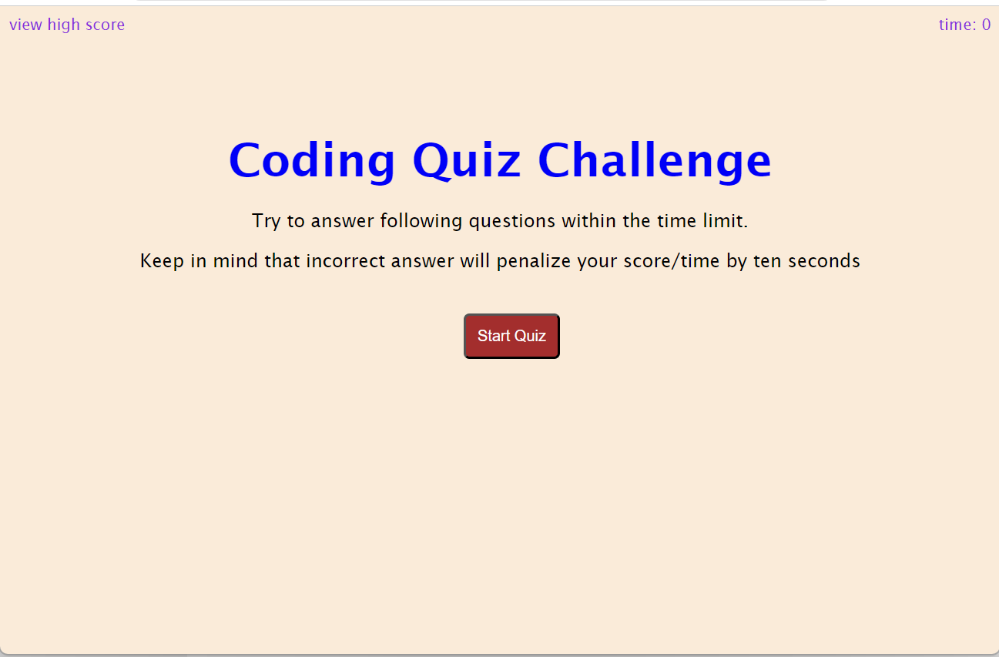
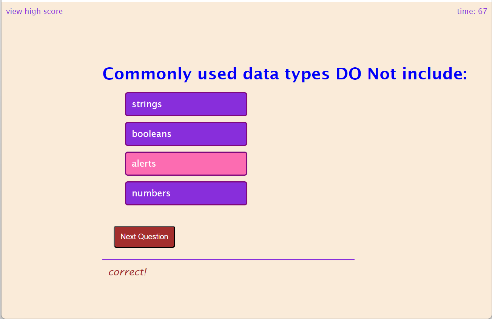
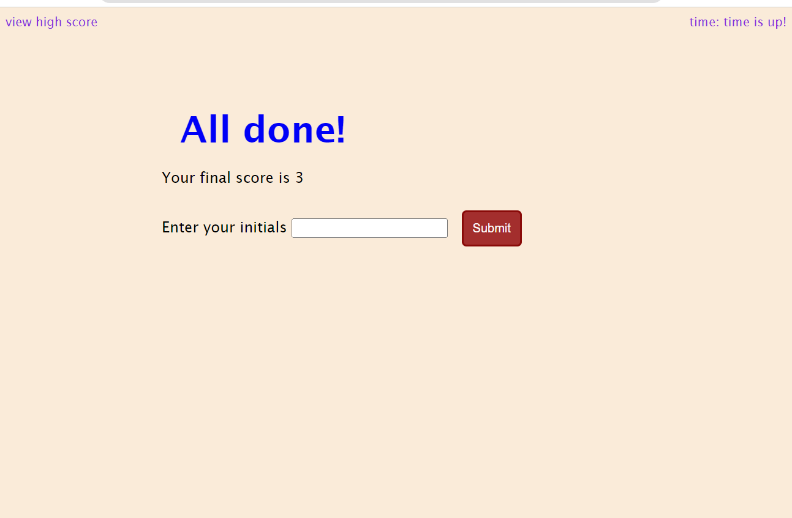
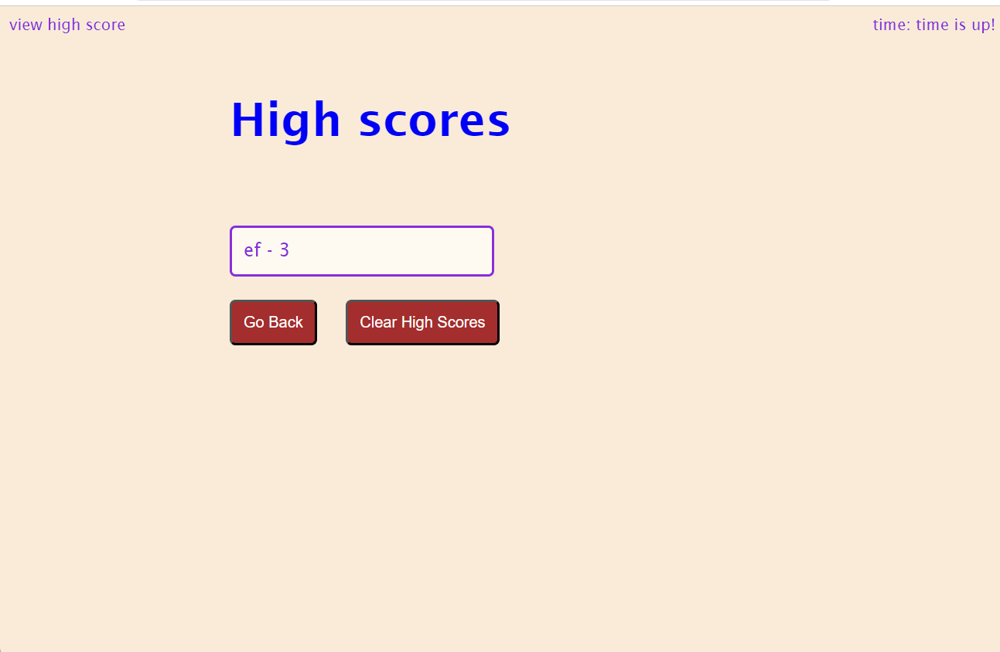

# Quiz webpage project

## Description

- User is taking a code quiz.
- After User clicks the start button then a timer starts and he/she is presented with a question.
- After answering a question User is presented with another question.
- If User answers a question incorrectly then time is subtracted from the clock.
- After all questions are answered or the timer reaches 0 then the game is over.
- If the game is over then User can save his/her initials and score.

## Usage

After clicking the link below you will be able to see deployed application.

https://elenafwork.github.io/04-Quiz/

The start page looks like this:

  

After clicking the 'Start Quiz' button you will be presented with the series of questions:

  

After all questions have been answered and/or time is finished, you will be able to see the result page where you can submit your initials.

  

After clicking the 'Submit' button you will be presented with the final page where you can decide whether you want to go to the start page by clicking 'Go Back' button or clean  the High Score Log.

  

## Credit

-  Zenva for 'Basic Quiz Tutorial' https://www.youtube.com/watch?v=RswgVWKJRLM
-  StackOverflow https://stackoverflow.com/questions/11563638/how-do-i-get-the-value-of-text-input-field-using-javascript 

## License

Please, refer to the repo license.